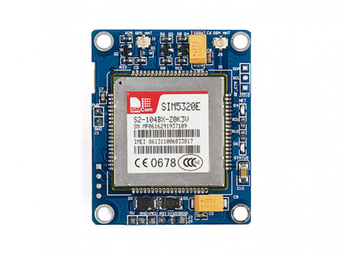

# SIM5320 interface library

The library contains an SIM5320 driver for mbed-os.

The SIM5320 documentation can be found here:

- [Hardware description](https://simcom.ee/documents/SIM5320/SIM5320_Hardware_Design_V1.07.pdf)
- [AT command set](https://simcom.ee/documents/SIM5320/SIMCOM_SIM5320_ATC_EN_V2.05.pdf)
- [Other documentation and examples](https://simcom.ee/documents/?dir=SIM5320)

The library allows:

- get GPS coordinates and current UTC time
- send SMS

## Driver usage

Typical library usage consists of the following steps:

1. create `SIM5320` driver instances;
2. invoke `init` method. This method checks that device works, and sets some default settings;
3. invoke `start` method to activate device function. By default SIM5320 is in the minimal functionality mode 
   to reduce power consumption. The `init` method also switches SIM5320 to minimal functionality mode explicitly.
4. Enable and use device functions (GPS/network/sms).
5. If device isn't needed, it's recommended to invoke `stop` method. It will switch SIM5320 to minimal functionality mode
   to reduce power consumption.

The examples of the GPS/network/sms usage can be found in the `examples` directory.

## Troubleshooting

If after some AT commands the UART interface configuration was changed and it doesn't work,
you can reset device to factory settings, using the following steps:

1. connect device to PC using usb (usually boards have micro connector);
2. find virtual COM device for AT commands. The PC can find up to 6 virtual com ports,
   so you probably should check each port using baud rate 115200 and `AT` or `AT+CFUN?`;
   commands to check if it's AT command interface.
3. send `AT&F1` command to reset device to factory settings;
4. restart device manually.

## TODO:

- add functions to use TCP and UDP connection
- add mbed-os network stack compatable interface
- add FTP client functionality
